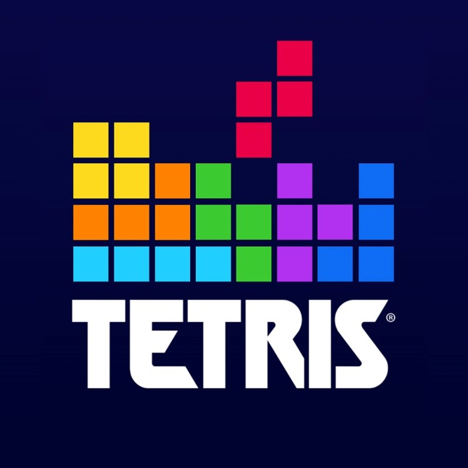
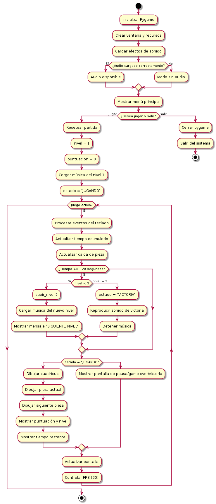
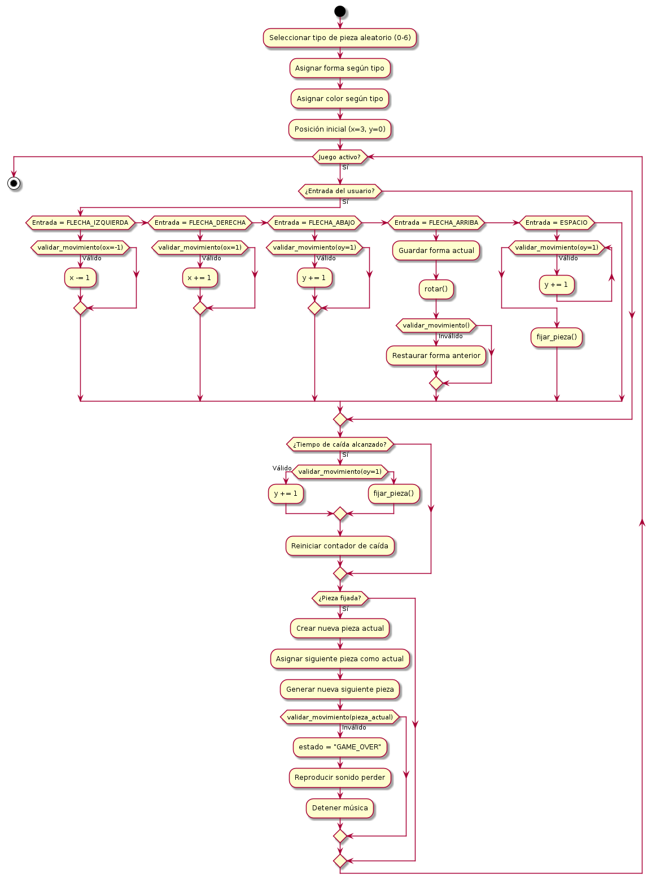
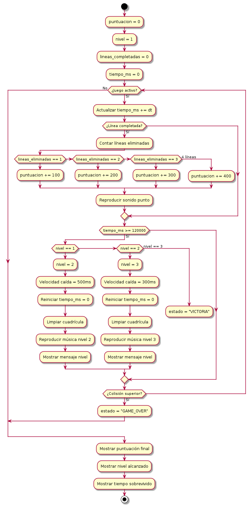
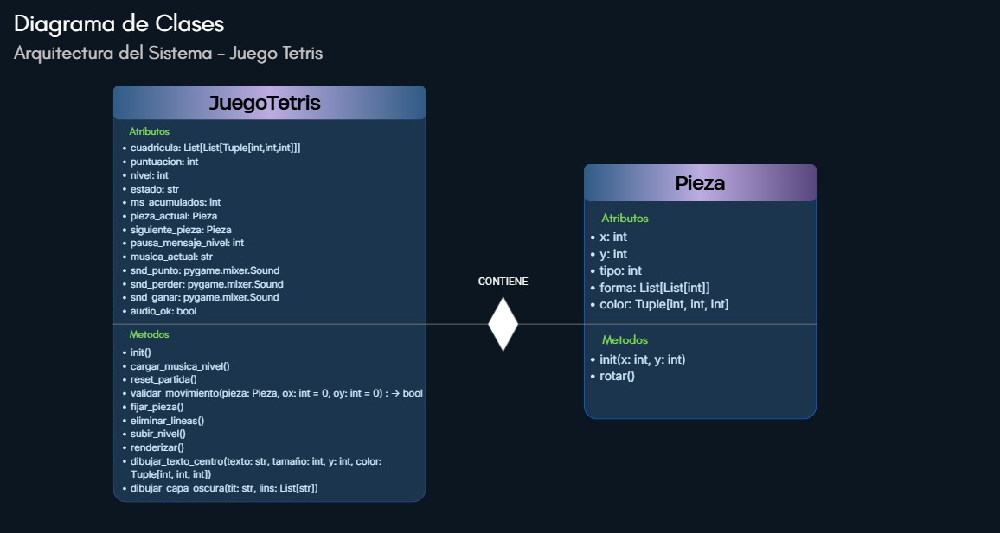

= Proyecto: Tetris Ultimate

== Autores
* Allan González 
* Andrés Reyes 
* Fernando Reyes
* Mitchael Ruíz

== *Problema*
El usuario requiere un juego de Tetris interactivo para un jugador real que permita competir en una serie de niveles, utilizando una interfaz gráfica y siguiendo el paradigma de Programación Orientada a Objetos.

== *Requerimientos*

=== *Requerimientos Funcionales*
* Pantalla de Inicio 
* Sistema de juego para 1 jugador real de forma local.
* Controles Jugador 1: Flecha arriba (rotación), Flecha Abajo, Flecha Izquierda, Flecha Derecha, Barra Espaciadora.
* Lógica de puntuación:
** Completar una línea horizontal de todas las piezas.
* Niveles:
** Sistema de 3 niveles aumentando la dificultad en cada uno de ellos, en velocidad del juego y piezas mostradas.

=== *Requerimientos No Funcionales*
* Sistema Operativo: Debian 13.
* Paradigma de programación: POO (Orientado a Objetos).
* Lenguaje: Python 3.
* Interfaz Gráfica: GUI mediante la librería Pygame.
* Documentación: Formato Asciidoctor (.adoc).

=== *Diseños de Flujo y Clase*
Los presentes diagramas puml y de Clase del presente código de nuestro juego Tetris.

== *Diseño de Funcionamiento general*

Descripción: Representa el flujo principal desde la inicialización de Pygame, la gestión del menú y el bucle de juego (game loop). Incluye la lógica de actualización de estados (tiempo, niveles y victoria), el renderizado de la interfaz gráfica y el control de frames por segundo (60 FPS).

== *Diseño de Piezas*

Descripción: Detalla la manipulación de piezas, cubriendo la selección aleatoria, el procesamiento de entradas de teclado (movimiento y rotación) y la validación de colisiones. Incluye la lógica de caída automática, el fijado de piezas en la cuadrícula y la detección de la condición de Game Over por bloqueo superior.

== *Diseño de Puntuación*

Descripción: Expone el sistema de métricas del juego. Describe el cálculo de puntos basado en el número de líneas eliminadas simultáneamente, la progresión de dificultad mediante el cambio de niveles cada 120 segundos y las acciones asociadas a cada transición (cambio de velocidad, música y limpieza de pantalla).

== *Diagrama de Clase*

